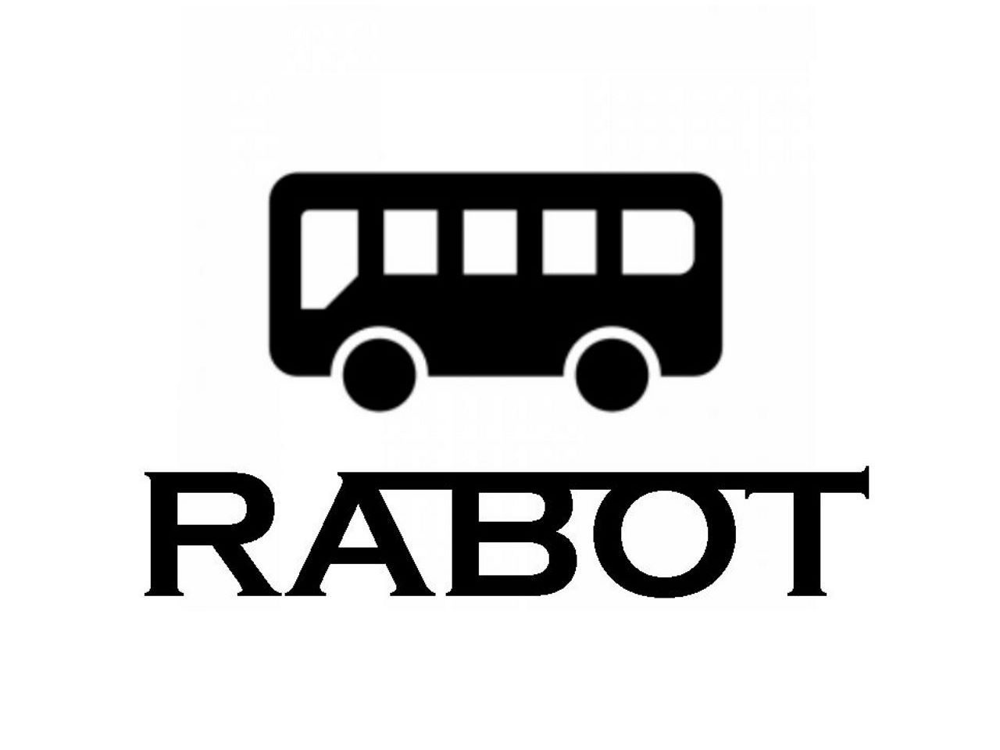

<div align="center">

# RABOT

学生生活の予定管理・通知を担う、Google Apps Script 製の LINE Bot

[](https://developers.google.com/apps-script)
[](https://developers.line.biz/ja/services/messaging-api/)
[](https://www.google.com/sheets/about/)
[](https://calendar.google.com/)



</div>

> [!NOTE]
> このプロジェクトは開発を終了しており、現在はメンテナンスされていません。

## 概要

RABOT は、クラスの課題・連絡・バスの時刻表といった「毎日ちょっと確認したい情報」を LINE のトーク画面から引き出せるようにする Bot です。日常の「ちょっと面倒」を減らし、みんなの時間を効率的に使えるようにすることを目指して、仲間とともに開発・運用・改善を続けてきました。

バックエンドは Google Apps Script（GAS）のみで構成し、Google スプレッドシートをデータベース、Google カレンダーを予定の入力元として使います。サーバーを持たず、スプレッドシートやカレンダーを編集するだけで配信内容を更新できるのが特徴です。

## 特徴

- **課題・連絡の一覧表示** — 「課題」「連絡」でスプレッドシートの内容を一覧返信。「課題1」〜「課題10」のクイックリプライで個別の詳細も確認できる
- **バス時刻表と時間割** — 「バス」でスクリプトプロパティに保存した Flex Message（返信用 `messages` 配列の JSON）を、「時間割」で時間割画像を返信
- **Google カレンダー連携** — 2 か月先までの予定を取得し、通常カレンダーはタイトルに「課題」「連絡」を含む予定を課題 / 連絡シートへ、リマインダー用カレンダーは全予定をリマインダーシートへ書き出す
- **プッシュ通知** — LINE の multicast API で複数ユーザーへ一斉送信するヘルパーと、当日 20:00 に 1 回だけ発火する単発トリガーの登録関数を持つ
- **ユーザー管理とログ** — 統計シートでユーザーを照合し、ブロック済みユーザーには利用不可メッセージを返信。受信メッセージはすべてログシートに記録
- **Web 設定ページ** — `docs/` の静的サイトから予定登録・リマインダー登録・キャラ設定・前日通知の切り替え・統計閲覧を行う（GitHub Pages 用。現在は公開停止）

### 対応コマンド

| メッセージ | 応答 |
| --- | --- |
| `課題` | 課題一覧（番号 1〜10 のクイックリプライ付き） |
| `課題N` | N 番目の課題のタイトルと詳細 |
| `連絡` | 連絡一覧 |
| `リマインダー` | テキスト「リマインダーです」 |
| `設定` | 登録 / 削除の 2 ボタン（いずれも `WEBSITE_URL` へのリンク） |
| `時間割` | 時間割画像 |
| `バス` | バス時刻表（Flex Message） |
| `ツール` | 説明 / 設定 / 統計の 3 ボタン（いずれも `WEBSITE_URL` へのリンク） |
| `その他` | 時間割・グループ送信を選ぶボタンテンプレート |
| `ブロック` | 利用不可メッセージ（ブロック済みユーザーの内部分岐にも使用） |
| 上記以外 | 未登録コマンド用の画像 |

## 技術スタック

| 領域 | 技術 |
| --- | --- |
| ランタイム | Google Apps Script（V8 ランタイム、タイムゾーン Asia/Tokyo） |
| メッセージング | LINE Messaging API（reply / multicast） |
| データストア | Google スプレッドシート（`課題` `連絡` `リマインダー` `統計` `ログ` の 5 シート） |
| 予定の入力元 | Google カレンダー（通常用・リマインダー用の 2 つ） |
| Web ページ | 静的 HTML / CSS + jQuery（CDN 読み込み） |

## セットアップ

### 前提

- Google アカウント（Apps Script・スプレッドシート・カレンダー）
- LINE Developers の Messaging API チャネルとチャネルアクセストークン

### 手順

1. Google スプレッドシートを作成し、`課題` `連絡` `リマインダー` `統計` `ログ` の 5 シートを用意します。`統計` シートは B 列に LINE の userId、F 列にキャラタイプ、G 列にブロックフラグを持ちます。
2. スプレッドシートの「拡張機能 > Apps Script」からコンテナバインド型のプロジェクトを開き、`src/*.gs` と `appsscript.json` の内容を配置します。`SpreadsheetApp.getActiveSpreadsheet()` で紐づくシートを参照するため、スタンドアロン型では動作しません。
3. スクリプトプロパティに以下の値を設定します。

   | キー | 内容 |
   | --- | --- |
   | `ACCESS_TOKEN` | LINE Messaging API のチャネルアクセストークン |
   | `CALENDAR_ID` | 課題・連絡を取得する Google カレンダーの ID |
   | `CALENDAR_REM_ID` | リマインダー用 Google カレンダーの ID |
   | `IMG_UNREGISTERED` | 未登録コマンド時に返す画像の URL |
   | `IMG_TIMETABLE` | 時間割画像の URL |
   | `BUS_DATA` | バス時刻表の返信 `messages` 配列（Flex Message を含む JSON 配列の文字列。`[{"type":"flex", ...}]` の形） |
   | `WEBSITE_URL` | 設定・統計ページ（`docs/`）の公開 URL |

4. 「デプロイ > 新しいデプロイ」でウェブアプリとして公開します（`appsscript.json` の設定どおり、実行ユーザー: 自分、アクセス: 全員）。発行された URL を LINE Developers の Webhook URL に登録します。
5. カレンダーの予定をシートに反映するため、`getSchedule` を時間主導型トリガーに登録します。
6. （任意）`docs/` を GitHub Pages などで公開し、その URL を `WEBSITE_URL` に設定します。

## 構成

```text
.
├── appsscript.json      # GAS マニフェスト（V8 / Asia/Tokyo / ウェブアプリ設定）
├── src/
│   ├── config.gs        # スクリプトプロパティの読み込みと定数
│   ├── main.gs          # doPost: Webhook 受信・コマンド振り分け・ログ記録
│   ├── functions.gs     # ユーザー認証と各メッセージの生成
│   ├── getSchedule.gs   # Google カレンダー → シート同期、トリガー作成
│   └── push.gs          # multicast によるプッシュ通知
└── docs/                # 設定・統計用の静的サイト（GitHub Pages 想定）
    ├── index.html       # トップページ
    ├── about.html       # コマンド説明
    ├── add.html         # 予定（課題・連絡）登録
    ├── rem_add.html     # リマインダー登録
    ├── set.html         # キャラ設定・前日通知の切り替え
    └── stats.html       # 利用統計
```

`docs/` の `add` `rem_add` `set` `stats` の 4 ページは `?id=<ユーザー番号>&api=add|rem_add|set|stats` の形式で GAS ウェブアプリを GET 呼び出ししますが、その `doGet` 側の実装は本リポジトリには含まれていません。
